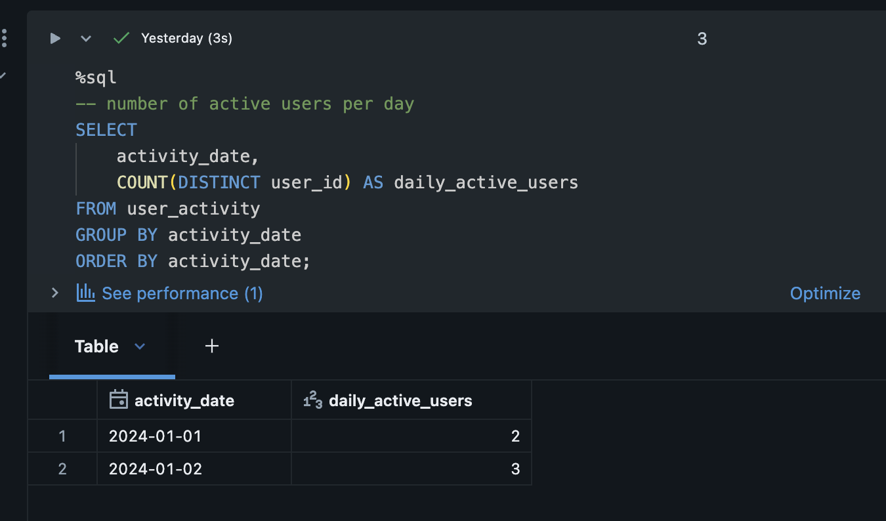
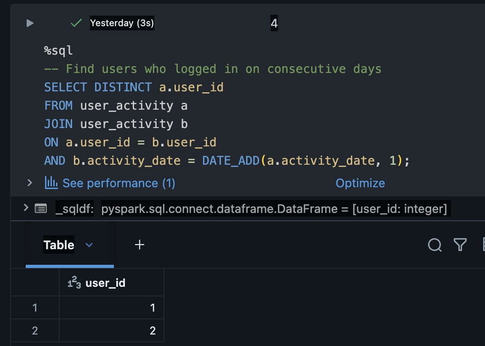
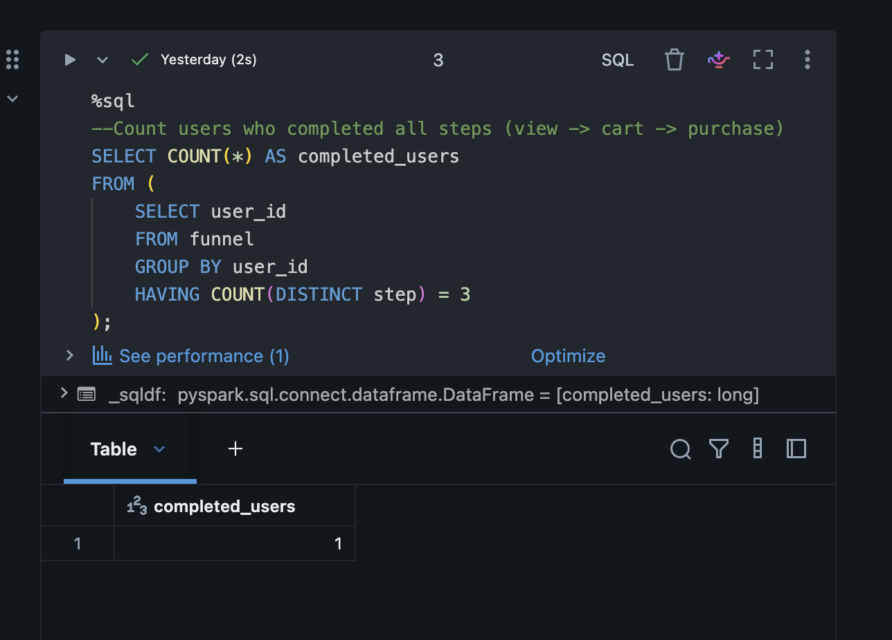
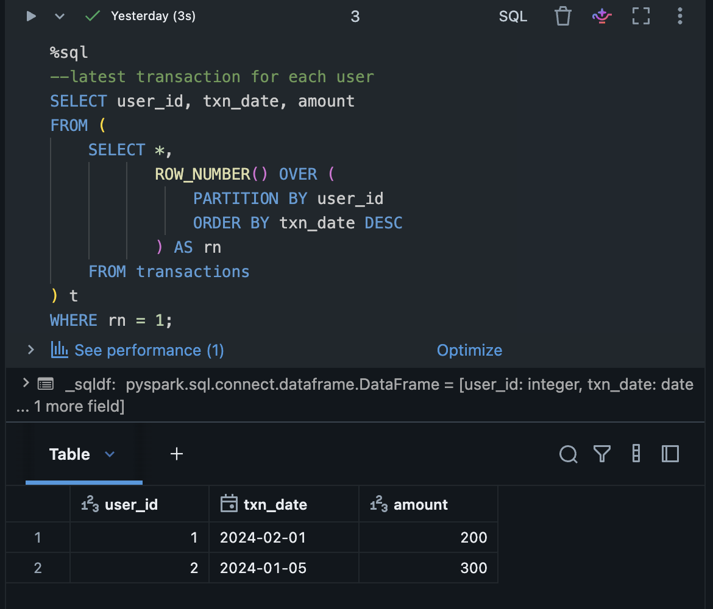
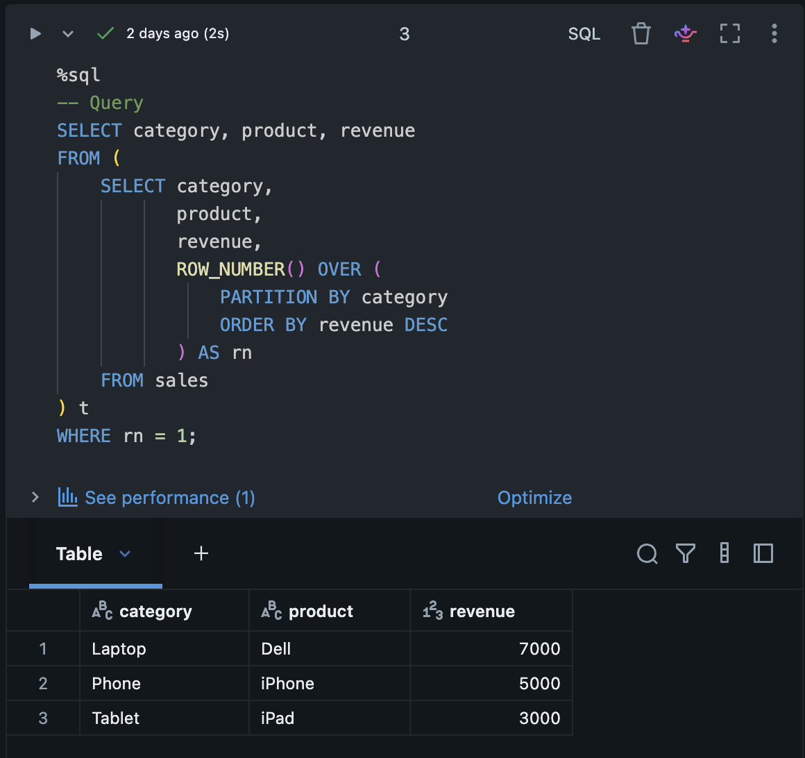

# 📊 Databricks SQL Analytics Project

## 🚀 About This Project
This project showcases SQL-based analytics problems solved using Databricks.  
It focuses on real-world data analysis scenarios to strengthen my skills in SQL, data analysis, and data engineering concepts.

---

## 🛠️ Tools & Technologies
- Databricks
- SQL
- Apache Spark (Databricks environment)

---

## 📌 Problems Solved

| Notebook | Description |
|---|---|
| Daily_active_users.ipynb | Calculates daily active users |
| Funnel_Analysis.ipynb | Analyzes user journey (view → cart → purchase) |
| latest_transaction_per_user.ipynb | Finds the latest transaction for each user |
| top_product_per_category.ipynb | Identifies top product per category |

---

## 📸 Query Results (Databricks Output)

### Daily Active Users1

### Daily Active Users1

### Funnel Analysis

### Latest Transaction per User

### Top Product per Category

---

## 🧠 Concepts Practiced
- GROUP BY and Aggregations  
- COUNT and Filtering  
- Window Functions (ROW_NUMBER)  
- Subqueries  
- Funnel Analysis  
- Latest Record per User  
- Top product Analysis  

---

## 🎯 What I Learned
Through this project, I gained hands-on experience solving real-world analytics problems using SQL in Databricks.  
I improved my understanding of query optimization, data aggregation, and analytical thinking.

---

## 👩‍💻 About Me
Hi, I’m Nisha Adhikari 👋  
I’m an aspiring Data Engineer currently learning SQL, Python, and data pipelines using Databricks and Apache Spark.

---
